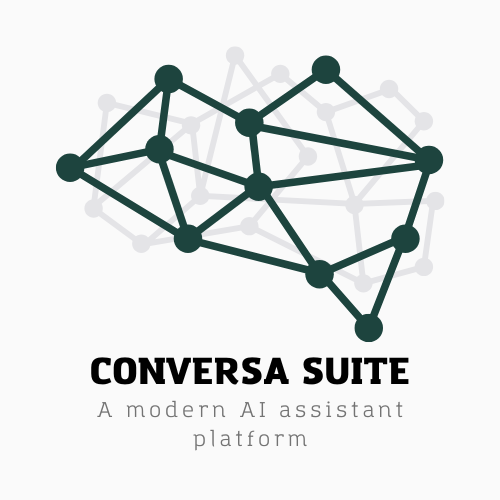

# Conversa Suite AI Chatbot

<p align="center">
  
</p>

Conversa Suite is an open-source AI chatbot platform that integrates LangChain with LangGraph to create powerful, customizable conversational experiences. The platform features a FastAPI backend, a Next.js user interface, and a React admin dashboard.

## 🌟 Project Overview

Conversa Suite provides a complete solution for building, deploying, and managing AI chatbots. Key features include:

- **Powerful AI Conversations**: Leverages LangChain and LangGraph for sophisticated conversation flows
- **Dual Interface**: User-facing chat interface and admin dashboard for management
- **Document Processing**: Upload and process documents for knowledge-based conversations
- **Customizable Behavior**: Easily configure the chatbot's personality, knowledge, and capabilities
- **Scalable Architecture**: Built with modern technologies for performance and scalability
- **Open Source**: Free to use, modify, and extend for your specific needs

## 🛠️ Tech Stack

### Backend
- **FastAPI**: High-performance API framework
- **LangChain & LangGraph**: For LLM orchestration and conversation flows
- **MongoDB**: Document database for storing conversations and user data
- **OpenAI Integration**: Connects to OpenAI's powerful language models
- **JWT Authentication**: Secure user authentication
- **Docker**: Containerization for easy deployment

### Frontend (User Interface)
- **Next.js 15**: React framework with server-side rendering
- **Assistant UI**: Specialized UI components for chat interfaces
- **Tailwind CSS**: Utility-first CSS framework
- **TypeScript**: Type-safe JavaScript

### Admin Dashboard
- **React**: Frontend library for building the admin interface
- **Vite**: Build tool for fast development
- **TypeScript**: For type safety

## 📁 Project Structure

```
conversa-suite/
├── backend/                # FastAPI backend application
│   ├── src/                # Source code
│   │   ├── api/            # API endpoints
│   │   ├── core/           # Core functionality
│   │   ├── db/             # Database models and connections
│   │   ├── llm/            # LLM integration with LangChain
│   │   └── utils/          # Utility functions
│   ├── test/               # Backend tests
│   ├── .env                # Environment variables
│   ├── env.template        # Template for environment variables
│   ├── requirements.txt    # Python dependencies
│   └── Dockerfile          # Docker configuration for backend
│
├── conversa-ui/            # Next.js frontend for users
│   ├── app/                # Next.js app directory
│   ├── components/         # React components
│   ├── lib/                # Utility functions and hooks
│   ├── .env                # Environment variables
│   └── package.json        # Node.js dependencies
│
├── admin-ui/               # React admin dashboard
│   ├── src/                # Source code
│   ├── .env                # Environment variables
│   └── package.json        # Node.js dependencies
│
├── data/                   # Data storage directory
├── deployment/             # Deployment configurations
├── docker-compose.yml      # Docker Compose configuration
└── README.md               # Project documentation
```

## 🚀 How to Run the Project

### Prerequisites
- Node.js 18+ and npm/pnpm
- Python 3.10+
- Docker and Docker Compose (optional, for containerized deployment)
- MongoDB (can be run via Docker)
- OpenAI API key

### Backend Setup

1. Navigate to the backend directory:
   ```bash
   cd backend
   ```

2. Create a virtual environment and activate it:
   ```bash
   python -m venv venv
   source venv/bin/activate  # On Windows: venv\Scripts\activate
   ```

3. Install dependencies:
   ```bash
   pip install -r requirements.txt
   ```

4. Set up environment variables:
   ```bash
   cp env.template .env
   ```
   Edit the `.env` file and add your OpenAI API key and other settings.

5. Run the backend server:
   ```bash
   python main.py
   ```
   The API will be available at `http://localhost:8000`.

### User Interface Setup

1. Navigate to the conversa-ui directory:
   ```bash
   cd conversa-ui
   ```

2. Install dependencies:
   ```bash
   npm install
   # or
   pnpm install
   ```

3. Set up environment variables:
   ```bash
   cp .env.example .env
   ```
   Update the `.env` file with your backend API URL.

4. Run the development server:
   ```bash
   npm run dev
   # or
   pnpm dev
   ```
   The UI will be available at `http://localhost:3000`.

### Admin Dashboard Setup

1. Navigate to the admin-ui directory:
   ```bash
   cd admin-ui
   ```

2. Install dependencies:
   ```bash
   npm install
   # or
   pnpm install
   ```

3. Set up environment variables:
   ```bash
   cp .env.example .env  # If .env.example exists
   ```
   Update the `.env` file with your backend API URL.

4. Run the development server:
   ```bash
   npm run dev
   # or
   pnpm dev
   ```
   The admin dashboard will be available at `http://localhost:5173`.

### Using Docker (Optional)

To run the entire stack with Docker:

1. Make sure Docker and Docker Compose are installed.

2. Update the environment variables in each component's `.env` file.

3. Run the following command from the project root:
   ```bash
   docker-compose up -d
   ```

## 🔧 How to Customize the Project

### Customizing the Chatbot Behavior

1. **Personality and Knowledge**:
   - Edit the prompt templates in `backend/src/llm/prompts/`
   - Modify the conversation flow in `backend/src/llm/graph/`

2. **Adding Custom Tools**:
   - Create new tool definitions in `backend/src/llm/tools/`
   - Register them in the LangGraph workflow

3. **Document Processing**:
   - Customize document processors in `backend/src/core/document_processors/`
   - Configure vector store settings in `.env`

### Customizing the User Interface

1. **Appearance**:
   - Modify the Tailwind configuration in `conversa-ui/tailwind.config.ts`
   - Update components in `conversa-ui/components/`

2. **Chat Features**:
   - Customize chat components in `conversa-ui/components/chat/`
   - Add new features by extending the Assistant UI components

### Customizing the Admin Dashboard

1. **Dashboard Layout**:
   - Modify the components in `admin-ui/src/components/`
   - Update the routes in `admin-ui/src/routes/`

2. **Admin Features**:
   - Add new management features in `admin-ui/src/features/`
   - Extend the API client in `admin-ui/src/api/`

## 📝 License

This project is licensed under the MIT License - see the [LICENSE](LICENSE) file for details.

## 🤝 Contributing

Contributions are welcome! Please feel free to submit a Pull Request.

1. Fork the repository
2. Create your feature branch (`git checkout -b feature/amazing-feature`)
3. Commit your changes (`git commit -m 'Add some amazing feature'`)
4. Push to the branch (`git push origin feature/amazing-feature`)
5. Open a Pull Request

## 📬 Contact

For questions or support, please open an issue on GitHub or contact the maintainers.

---

<p align="center">
  Made with ❤️ by the Conversa Suite Team
</p> 